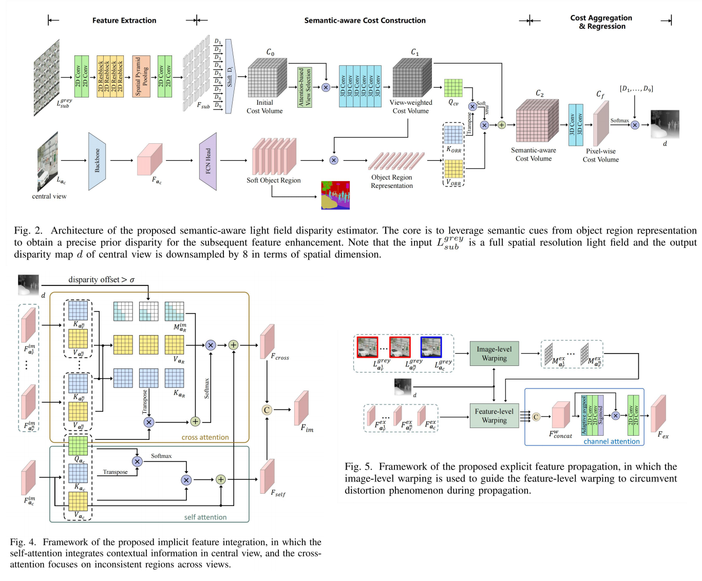
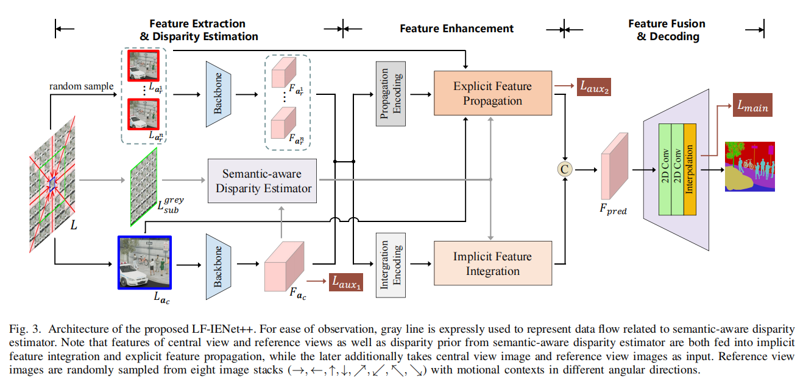
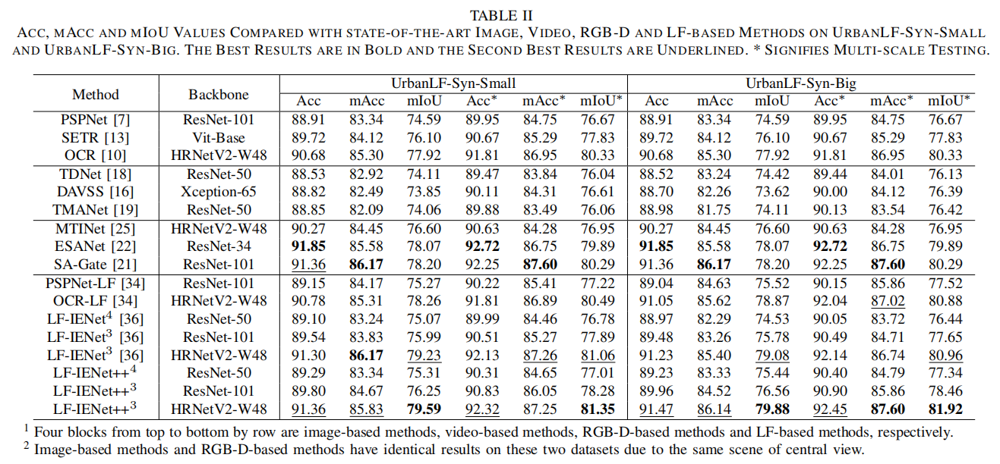

# LF-IENet++

This is the official pytorch implementation repository of [End-to-End Semantic Segmentation Utilizing Multi-scale Baseline Light Field](https://ieeexplore.ieee.org/document/10440124) (IEEE TCSVT 2024), which is an extension of our conference version [Combining Implicit-Explicit View Correlation for Light Field Semantic Segmentation.](https://openaccess.thecvf.com/content/CVPR2023/html/Cong_Combining_Implicit-Explicit_View_Correlation_for_Light_Field_Semantic_Segmentation_CVPR_2023_paper.html) (CVPR 2023)

## Introduction

We propose a novel semantic segmentation network called **LF-IENet++** suitable for **both narrow-baseline light field and wide-baseline light field**. It follows implicit feature integration and explicit feature propagation proposed in [LF-IENet](https://github.com/Congrx/LF-IENet) to mine complementary information from surrounding views to segment central view. On this basis, in order to concentrate on inconsistent context between view images during feature integration, we shield small disparity regions manifested as repeat content to avoid redundant attention. Besides, a two-stage operation consisting of the image-level warping and feature-level warping is introduced to mitigate the propagation distortion.  Since both feature integration and feature propagation require exact guidance from prior disparity, we design a semantic-aware disparity estimator that leverages semantic cues to optimize disparity generation while ensuring that LF-IENet++ can perform semantic segmentation in an end-to-end solution.






## Results




## UrbanLF-Multiscale-Baseline-Dataset

**UrbanLF-Multiscale-Baseline-Dataset** is a high-quality and challenging urban scene light field dataset, **containing sparsely sampled as well as densely sampled synthetic light field samples that share the same scenarios**. It is created by Blender on the basis of UrbanLF-Syn. 

Please download the datasets in the official repository of [UrbanLF](https://github.com/HAWKEYE-Group/UrbanLF).


## Code

This repository is implemented with the open source [mmsegmentation toolbox](https://github.com/open-mmlab/mmsegmentation).

### Dependencies

- `pytorch` 1.8.0 + `torchvision` 0.9.0 + `mmcv` 1.6.2 + `cuda` 10.2 + `python` 3.8.10

### Training and Test Data

1. Please refer to [UrbanLF](https://github.com/HAWKEYE-Group/UrbanLF) for `UrbanLF-Syn-Big` dataset and `UrbanLF-Syn-Small` dataset and `UrbanLF-Real` dataset.

3. The final datasets store on `./data/UrbanLF_Real` and `./data/UrbanLF_Syn_big_dis(UrbanLF_Syn_small_dis)` path. The file structure of dataset is as followed.   

   ```
   ├── data                                              ├── data                              
   │   ├── UrbanLF_Real                                  │   ├── UrbanLF_Syn_big_dis(UrbanLF_Syn_small_dis)    
   │   │   ├── train                                     │   │   ├── train  
   │   │   │   ├── Imagexxx                              │   │   │   ├── Imagexxx       
   │   │   │   │   ├── u_v.png(1_1.png~9_9.png)          │   │   │   |   ├── u_v.png(1_1.png~9_9.png)       
   │   │   │   │   ├── label.npy                         │   │   │   |   ├── 5_5_label.npy        
   │   │   │   ├── Imageyyy                              │   │   │   ├── Imageyyy   
   |   |   |   ├── Imagezzz                              │   │   │   ├── Imagezzz
   │   │   ├── val                                       │   │   ├── val               
   │   │   │   ├── Imagexxx                              │   │   │   ├── Imagexxx              
   │   │   │   │   ├── u_v.png(1_1.png~9_9.png)          │   │   |   |   ├── u_v.png(1_1.png~9_9.png)                    
   │   │   │   │   ├── label.npy                         │   │   │   |   ├── 5_5_label.npy   
   │   │   │   ├── Imageyyy                              │   │   │   ├── Imageyyy   
   |   |   |   ├── Imagezzz                              |   |   |   ├── Imagezzz
   │   │   ├── test                                      │   │   ├── test            
   │   │   │   ├── Imagexxx                              │   │   │   ├── Imagexxx   
   │   │   │   │   ├── u_v.png(1_1.png~9_9.png)          │   │   │   |   ├── u_v.png(1_1.png~9_9.png)        
   │   │   │   ├── Imageyyy                              │   │   │   ├── Imageyyy                            
   |   |   |   ├── Imagezzz                              │   │   │   ├── Imagezzz 
   ```

### Train

- Train `LF-IENet++`$^{3}$`-HR48` on `UrbanLF-Syn-Big-dis` dataset.  			

```shell
CUDA_VISIBLE_DEVICES='0,1' python -m torch.distributed.launch --nproc_per_node 2 --master_port 1123  train.py configs/lf/UrbanLF_Syn_Big_dis/lfienetplusrefine_hr48_480x480_80k_UrbanLF_Syn_Big_dis.py --launcher 'pytorch' 
```

- Train `LF-IENet++`$^{4}$`-Res50` on `UrbanLF-Syn-Big-dis` dataset.           

```shell
CUDA_VISIBLE_DEVICES='0,1' python -m torch.distributed.launch --nproc_per_node 2 --master_port 1123  train.py configs/lf/UrbanLF_Syn_Big_dis/lfienetplusrefine_ref4_r50-d8_480x480_80k_UrbanLF_Syn_Big_dis.py --launcher 'pytorch' 
```

- Train `LF-IENet++`$^{3}$`-Res101` on `UrbanLF-Syn-Big-dis` dataset.          

```shell
CUDA_VISIBLE_DEVICES='0,1' python -m torch.distributed.launch --nproc_per_node 2 --master_port 1123  train.py configs/lf/UrbanLF_Syn_Big_dis/lfienetplusrefine_ref3_r101-d8_480x480_80k_UrbanLF_Syn_Big_dis.py --launcher 'pytorch' 
```

- Train `LF-IENet++`$^{3}$`-HR48` on `UrbanLF-Syn-Small-dis` dataset.           

```shell
CUDA_VISIBLE_DEVICES='0,1' python -m torch.distributed.launch --nproc_per_node 2 --master_port 1123  train.py configs/lf/UrbanLF_Syn_Small_dis/lfienetplusrefine_hr48_480x480_80k_UrbanLF_Syn_Small_dis.py --launcher 'pytorch' 
```

- Train `LF-IENet++`$^{4}$`-Res50` on `UrbanLF-Syn-Small-dis` dataset.      

```shell
CUDA_VISIBLE_DEVICES='0,1' python -m torch.distributed.launch --nproc_per_node 2 --master_port 1123  train.py configs/lf/UrbanLF_Syn_Small_dis/lfienetplusrefine_ref4_r50-d8_480x480_80k_UrbanLF_Syn_Small_dis.py --launcher 'pytorch' 
```

- Train `LF-IENet++`$^{3}$`-Res101` on `UrbanLF-Syn-Small-dis` dataset.     

```shell
CUDA_VISIBLE_DEVICES='0,1' python -m torch.distributed.launch --nproc_per_node 2 --master_port 1123  train.py configs/lf/UrbanLF_Syn_Small_dis/lfienetplusrefine_ref3_r101-d8_480x480_80k_UrbanLF_Syn_Small_dis.py --launcher 'pytorch' 
```

- Train `LF-IENet++`$^{3}$`-HR48` on `UrbanLF-Real` dataset.  		

```shell
CUDA_VISIBLE_DEVICES='0,1' python -m torch.distributed.launch --nproc_per_node 2 --master_port 1123  train.py configs/lf/UrbanLF_Real/lfienetplusrefine_hr48_432x432_80k_UrbanLF_Real.py --launcher 'pytorch' 
```

- Train `LF-IENet++`$^{4}$`-Res50` on `UrbanLF-Real` dataset.  			

```shell
CUDA_VISIBLE_DEVICES='0,1' python -m torch.distributed.launch --nproc_per_node 2 --master_port 1123  train.py configs/lf/UrbanLF_Real/lfienetplusrefine_ref4_r50-d8_432x432_80k_UrbanLF_Real.py --launcher 'pytorch' 
```

### Test

- Test `LF-IENet++`$^{3}$`-HR48` on `UrbanLF-Syn-Big-dis` dataset.  

```shell
CUDA_VISIBLE_DEVICES='0' python test.py configs/lf/UrbanLF_Syn_Big_dis/lfienetplusrefine_hr48_480x480_80k_UrbanLF_Syn_Big_dis.py work_dirs/lfienetplusrefine_hr48_480x480_80k_UrbanLF_Syn_Big_dis/best_mIoU.pth --show-dir img_res
```

- Test `LF-IENet++`$^{4}$`-Res50` on `UrbanLF-Syn-Big-dis` dataset.  

```shell
CUDA_VISIBLE_DEVICES='0' python test.py configs/lf/UrbanLF_Syn_Big_dis/lfienetplusrefine_ref4_r50-d8_480x480_80k_UrbanLF_Syn_Big_dis.py work_dirs/lfienetplusrefine_ref4_r50-d8_480x480_80k_UrbanLF_Syn_Big_dis/best_mIoU.pth --show-dir img_res
```

- Test `LF-IENet++`$^{3}$`-Res101` on `UrbanLF-Syn-Big-dis` dataset.  

```shell
CUDA_VISIBLE_DEVICES='0' python test.py configs/lf/UrbanLF_Syn_Big_dis/lfienetplusrefine_ref3_r101-d8_480x480_80k_UrbanLF_Syn_Big_dis.py work_dirs/lfienetplusrefine_ref3_r101-d8_480x480_80k_UrbanLF_Syn_Big_dis/best_mIoU.pth --show-dir img_res
```

- Test `LF-IENet++`$^{3}$`-HR48` on `UrbanLF-Syn-Small-dis` dataset.  

```shell
CUDA_VISIBLE_DEVICES='0' python test.py configs/lf/UrbanLF_Syn_Small_dis/lfienetplusrefine_hr48_480x480_80k_UrbanLF_Syn_Small_dis.py work_dirs/lfienetplusrefine_hr48_480x480_80k_UrbanLF_Syn_Small_dis/best_mIoU.pth --show-dir img_res
```

- Test `LF-IENet++`$^{4}$`-Res50` on `UrbanLF-Syn-Small-dis` dataset.  

```shell
CUDA_VISIBLE_DEVICES='0' python test.py configs/lf/UrbanLF_Syn_Small_dis/lfienetplusrefine_ref4_r50-d8_480x480_80k_UrbanLF_Syn_Small_dis.py work_dirs/lfienetplusrefine_ref4_r50-d8_480x480_80k_UrbanLF_Syn_Small_dis/best_mIoU.pth --show-dir img_res
```

- Test `LF-IENet++`$^{3}$`-Res101` on `UrbanLF-Syn-Small-dis` dataset.  

```shell
CUDA_VISIBLE_DEVICES='0' python test.py configs/lf/UrbanLF_Syn_Small_dis/lfienetplusrefine_ref3_r101-d8_480x480_80k_UrbanLF_Syn_Small_dis.py work_dirs/lfienetplusrefine_ref3_r101-d8_480x480_80k_UrbanLF_Syn_Small_dis/best_mIoU.pth --show-dir img_res
```

- Test `LF-IENet++`$^{3}$`-HR48` on `UrbanLF-Real` dataset.  

```shell
CUDA_VISIBLE_DEVICES='0' python test.py configs/lf/UrbanLF_Real/lfienetplusrefine_hr48_432x432_80k_UrbanLF_Real.py work_dirs/lfienetplusrefine_hr48_432x432_80k_UrbanLF_Real/best_mIoU.pth --show-dir img_res
```

- Test `LF-IENet++`$^{4}$`-Res50` on `UrbanLF-Real` dataset.  

```shell
CUDA_VISIBLE_DEVICES='0' python test.py configs/lf/UrbanLF_Real/lfienetplusrefine_ref4_r50-d8_432x432_80k_UrbanLF_Real.py work_dirs/lfienetplusrefine_ref4_r50-d8_432x432_80k_UrbanLF_Real/best_mIoU.pth --show-dir img_res
```

- The predict segmentation result will be saved in `numpy_res/UrbanLF_Syn_big_dis` and `numpy_res/UrbanLF_Syn_small_dis` and `numpy_res/UrbanLF_Real`.

  The qualitative results will be saved in `img_res`.

  The relative code is in `mmseg/apis/test.py (line 83 ~ line 86)`.

- Compress all folders directly into a zip file named as `*.zip` (any name is ok), and log in [lfchallenge](http://www.lfchallenge.com/sm_result/) to sumbit the zip file for Acc, mAcc, mIoU metric of the test subset of `UrbanLF-Real` and `UrbanLF-Syn-Big-dis` and `UrbanLF-Syn-Small-dis`. 

### Instruction

Detailed descriptions of some important files are as following.

- `configs/_base_/datasets`：Specific configuration information about dataset setting.

  ```python
  # multi-scale testing:
  test_pipeline = [
      dict(type='LoadImageFromFile'),
      dict(
          type='MultiScaleFlipAug',
          img_ratios=[1.0,0.75,1.5,1.25],
          flip=True,
  ]
  # single-scale testing:
  test_pipeline = [
      dict(type='LoadImageFromFile'),
      dict(
          type='MultiScaleFlipAug',
          img_ratios=[1.0],
          flip=False,
  ]
  ```

- `configs/lf/UrbanLF_Real` , `configs/lf/UrbanLF_Syn_Big_dis` , `configs/lf/UrbanLF_Syn_Small_dis`：Specific configuration information about experimental setting.

  - `configs/lf/UrbanLF_Syn_Big_dis/lfienetplusrefine_ref4_r50-d8_480x480_80k_UrbanLF_Syn_Big_dis.py`： `LF-IENet++`$^{4}$`-Res50` on `UrbanLF-Syn-Big-dis` dataset
  - `configs/lf/UrbanLF_Syn_Big_dis/lfienetplusrefine_ref3_r101-d8_480x480_80k_UrbanLF_Syn_Big_dis.py`： `LF-IENet++`$^{3}$`-Res101` on `UrbanLF-Syn-Big-dis` dataset
  - `configs/lf/UrbanLF_Syn_Big_dis/lfienetplusrefine_hr48_480x480_80k_UrbanLF_Syn_Big_dis.py`： `LF-IENet++`$^{3}$`-HR48` on `UrbanLF-Syn-Big-dis` dataset
  - `configs/lf/UrbanLF_Syn_Small_dis/lfienetplusrefine_ref4_r50-d8_480x480_80k_UrbanLF_Syn_Small_dis.py`： `LF-IENet++`$^{4}$`-Res50` on `UrbanLF-Syn-Small-dis` dataset
  - `configs/lf/UrbanLF_Syn_Small_dis/lfienetplusrefine_ref3_r101-d8_480x480_80k_UrbanLF_Syn_Small_dis.py`： `LF-IENet++`$^{3}$`-Res101` on `UrbanLF-Syn-Small-dis` dataset
  - `configs/lf/UrbanLF_Syn_Small_dis/lfienetplusrefine_hr48_480x480_80k_UrbanLF_Syn_Small_dis.py`： `LF-IENet`$^{3}$`-HR48` on `UrbanLF-Syn-Small-dis` dataset
  - `configs/lf/UrbanLF_Real/lfienetplusrefine_ref4_r50-d8_432x432_80k_UrbanLF_Real.py`： `LF-IENet++`$^{4}$`-Res50` on `UrbanLF-Real` dataset
  - `configs/lf/UrbanLF_Real/lfienetplusrefine_hr48_432x432_80k_UrbanLF_Real.py`： `LF-IENet++`$^{3}$`-HR48` on `UrbanLF-Real` dataset

- `mmseg/datasets/UrbanLF_Real.py `, `mmseg/datasets/UrbanLF_Syn.py`：Dataset loading file about `UrbanLF-Real` and `UrbanLF-Syn-Big-dis/UrbanLF-Syn-Small-dis`.

- `mmseg/models/decode_heads/lf_ienet_plus_refine.py`,`mmseg/models/decode_heads/lfhrnet_ienet_plus_refine.py`：Core composition about the proposed network `LF-IENet++-Res50/LF-IENet++-Res101` and `LF-IENet++-HR48`, respectively.

- `pretrained_models`：Pre-trained feature extraction backbones `ResNet50` and `ResNet101` and `HRNet48` on `ImageNet`. 

- `work_dirs`：Our pre-trained models  `LF-IENet++-Res50` and `LF-IENet++-Res101` and `LF-IENet++-HR48` with default configuration information on `UrbanLF-Real` and `UrbanLF-Syn-Big-dis` and `UrbanLF-Syn-Small-dis`. 

## Acknowledgement

Our work and implementations are inspired and based on the following projects:

- [mmsegmentation](https://github.com/open-mmlab/mmsegmentation)
- [UrbanLF](https://github.com/HAWKEYE-Group/UrbanLF)
- [LF-IENet](https://github.com/Congrx/LF-IENet)

We sincerely thank the authors for sharing their code and amazing research work!

## Citation

If you find this work helpful, please consider citing the following papers:

```
@ARTICLE{cong2024lfienetplus,
  author={Cong, Ruixuan and Sheng, Hao and Yang, Dazhi and Yang, Da and Chen, Rongshan and Wang, Sizhe and Cui, Zhenglong},
  journal={IEEE Transactions on Circuits and Systems for Video Technology}, 
  title={End-to-End Semantic Segmentation Utilizing Multi-scale Baseline Light Field}, 
  year={2024},
  doi={10.1109/TCSVT.2024.3367370}}

@inproceedings{cong2023lfienet,
  title={Combining Implicit-Explicit View Correlation for Light Field Semantic Segmentation},
  author={Cong, Ruixuan and Yang, Da and Chen, Rongshan and Wang, Sizhe and Cui, Zhenglong and Sheng, Hao},
  booktitle={Proceedings of the IEEE/CVF Conference on Computer Vision and Pattern Recognition},
  pages={9172--9181},
  year={2023}
}

@ARTICLE{sheng2022urbanlf,
  author={Sheng, Hao and Cong, Ruixuan and Yang, Da and Chen, Rongshan and Wang, Sizhe and Cui, Zhenglong},
  journal={IEEE Transactions on Circuits and Systems for Video Technology}, 
  title={UrbanLF: A Comprehensive Light Field Dataset for Semantic Segmentation of Urban Scenes}, 
  year={2022},
  volume={32},
  number={11},
  pages={7880-7893},
  doi={10.1109/TCSVT.2022.3187664}}
```

## Contact

If you have any questions regarding this work, please send an email to [congrx@buaa.edu.cn](mailto:congrx@buaa.edu.cn) . 
